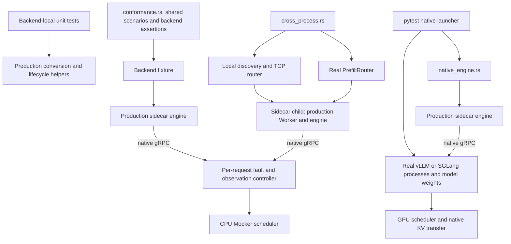

<!--
SPDX-FileCopyrightText: Copyright (c) 2026 NVIDIA CORPORATION & AFFILIATES. All rights reserved.
SPDX-License-Identifier: Apache-2.0
-->

# Sidecar testing

Unit tests live beside the production code they exercise. They construct inputs,
call the real parsing, conversion or state-management functions, and check the
results without starting an inference engine. Common behavior is tested in the
common crate; vLLM behavior is tested in the vLLM crate. There is no shared unit
scenario or backend-adapter layer.

## File layout

```text
lib/sidecar/
├── common/src/
│   ├── endpoint.rs            # Inline tests: endpoint parsing and normalization
│   ├── error.rs               # Inline tests: transport status mapping
│   └── transport.rs           # Inline test: startup deadline during retries
├── vllm/src/
│   ├── model.rs               # Inline test: local data-parallel ownership
│   ├── engine.rs              # Inline test: routing-configuration deadline
│   ├── json.rs                # Inline tests: JSON/protobuf conversion
│   ├── convert.rs             # Inline test: full-vocabulary logprobs
│   └── tests.rs               # Conversion tests and local fake-gRPC scenarios
└── testkit/
    ├── src/
    │   ├── control.rs          # Per-request controls, observations and controller test
    │   ├── server.rs           # Local server lifetime, including abrupt shutdown
    │   ├── fixtures.rs         # Shared request construction and stream collection
    │   └── assert.rs           # Token, terminal, usage and error assertions
    ├── tests/
    │   ├── conformance.rs     # Direct sidecar-to-Mocker scenarios over real gRPC
    │   ├── cross_process.rs   # Sidecar children, discovery, routing and shutdown
    │   ├── native_engine.rs   # Real vLLM/SGLang compatibility, cancellation and KV transfer
    │   └── support/
    │       ├── mod.rs         # Fixture contracts and scheduler-state waits
    │       ├── vllm.rs        # vLLM protocol, Mocker and child-command adapter
    │       ├── sglang.rs      # SGLang protocol, discovery, health and child-command adapter
    │       └── process.rs     # Local discovery, worker processes and TCP routing
    ├── native_probe.py        # Observes completed native NIXL transfers
    └── README.md              # This guide
```

Small suites use inline child modules marked `#[cfg(test)]` in their production
module.
The larger `vllm/src/tests.rs` suite is declared from `vllm/src/lib.rs` and
contains both direct conversion checks and scenarios using a local fake gRPC
server. Both styles compile into their crate's library test binary.

The testkit library owns request controls, bounded waits, stream collection,
assertions and server lifetime. Concrete sidecars, Mockers and protocol libraries
are development dependencies used by the integration tests. Production sidecars
and Mockers do not depend on testkit. Backend fixtures live in `tests/support/`
and are local to the integration suite, rather than a public fixture API.

## Adding a unit test

Add the test to its production module's existing test child module, or extend the
existing `vllm/src/tests.rs` suite when it already owns the relevant setup.
Use ordinary `#[test]` or `#[tokio::test]` attributes. Call the actual production
helper and assert the behavior being protected. Keep setup local unless several
tests need the same builder; a private helper does not need to become public
just to be tested from a child module.

Common parsing and transport behavior belongs in the common crate. A backend's
request fields, conversion and local state belong beside that backend's
implementation. Reserve the shared integration scenarios for contracts that
cross the native RPC or process boundary.

## Running tests

From the repository root, run common and vLLM library tests, their local-server
tests, and the testkit controller regression:

```sh
cargo test --locked -p dynamo-sidecar-common -p dynamo-vllm-sidecar \
  -p dynamo-sidecar-testkit --lib
```

Run one conversion test by its full name:

```sh
cargo test --locked -p dynamo-vllm-sidecar --lib \
  convert::candidate_tests::full_vocabulary_logprobs_select_all_candidates -- --exact
```

The vLLM dependency enables common's `tonic-v14` feature. To cover that version
when running common alone, add `--features tonic-v14`. Building requires the
repository's normal Rust prerequisites; running these suites needs no GPU,
model download or inference-engine installation.

CI runs them through the ordinary `cargo test --locked --all-targets` step and
nightly Rust coverage. There are no per-test lane markers or custom unit runner.

## Integration tests

A Mocker is a CPU simulation of an inference engine. The tests run production
sidecar code over real sockets, but the Mocker supplies tokens and scheduler
state instead of loading model weights. Process tests additionally launch the
actual sidecar executable and use the production Worker, discovery and router.
They create their own local tokenizer files, file-backed discovery and TCP
connections; neither etcd nor NATS is required.



The controller sits at the native protocol boundary. Each request ID has its
own plan and observations, so a test can hold or fail one request while proving
that another still completes. Wait for controller events rather than guessing
when work has started. A token checkpoint counts native responses containing
tokens, not individual tokens: a response may contain several tokens. Compare
the sidecar output with the controller's observed token vector.

The local test server owns a dedicated thread and runtime. Shutting it down
also drops accepted connections and RPC handlers, even when a test retains live
clients. That makes peer-loss tests deterministic.

### What runs where

| Suite | Scope | Execution |
| --- | --- | --- |
| `conformance.rs` | Shared streaming, errors, cancellation, cleanup, active work release, consumer drop, request/logprob fields and peer teardown for vLLM and SGLang; native rejection and malformed response checks | CPU, ordinary pre-merge Cargo tests |
| `cross_process.rs` | Both backends: registration/error recovery, readiness, startup failure, cancellation, SIGTERM and real PrefillRouter handoff; SGLang discovery identity, HealthCheck and changed-role startup | CPU, ordinary pre-merge Cargo tests |
| `native_engine.rs` | Real logprobs and structured output, native scheduler cancellation/drop, completed KV transfer between engines | GPU, post-merge and nightly via pytest |

A generic scenario is reusable code, not evidence that every backend runs it.
Both vLLM and SGLang register the shared wire and process scenarios.
TensorRT-LLM is not enrolled here.

The native tests retain their own purpose: a Mocker cannot prove that a real engine
accepts the serialized request, executes a structured-output constraint, releases
its real scheduler work, or transfers GPU KV cache. CPU handoff checks
opaque vLLM metadata and SGLang concurrent bootstrap coordination. Native handoff
separately requires completed transfer bytes and checks decode output length and token usage.
SGLang uses its native transfer metrics; vLLM uses the NIXL probe.
SGLang also cancels decode while its native transfer queue has work, then
requires that queue to drain before a following handoff succeeds. This does not
establish migration or cancellation while transfer packets are in flight.
CPU handoff cancellation holds the peers before Mocker admission; it proves
transport cleanup and recovery, not native scheduler or transfer cleanup.

Existing tests in `lib/mocker/servers/{vllm,sglang}/tests/sidecar.rs` retain distinct
KV-event and handoff coverage. Backend-local socket tests in `vllm/src/tests.rs`
retain broader media, LoRA, administrative and connection behavior. Python
serving and fault-tolerance tests remain in place: passing this testkit does not
establish complete parity with the legacy Python backend.

### Adding an integration test

1. Choose the boundary being protected. Parsing and state transitions without
   I/O belong beside production code. Direct native RPC behavior belongs in
   `conformance.rs`; Worker/discovery or process lifetime belongs in
   `cross_process.rs`. Use `native_engine.rs` only when the assertion requires
   an actual inference engine or GPU state.
2. For shared behavior, write a scenario accepting only its fixture type. Use
   `SidecarFixture` for the common engine lifecycle, `WireFixture` when a test
   must observe active scheduler work, and `ProcessFixture` when it launches a
   sidecar child. Keep protocol messages in the backend's support file.
3. Register common baseline scenarios once in the small enrollment macro. Both
   backends invoke the same macro, producing a separate ordinary Tokio test for
   every scenario. The macro only declares tests; it does not run or select them
   dynamically. A new baseline is therefore included for every enrolled backend.
4. Put a genuine difference in a named fixture value, such as whether
   `generate()` waits for response headers. Keep checks meaningful for each
   backend: SGLang starts its lazy RPC when the response stream is polled.
   A check that only describes vLLM protobuf fields or errors belongs in an
   explicit vLLM test, not an optional callback or a no-op fixture method.
5. Give faulted requests distinct IDs. Await the received/checkpoint/dropped
   event, assert the observed prefix and terminal or typed error, and prove
   scheduler/route release. Where recovery is part of the contract, send a
   healthy request through the same engine. Use bounded waits and preserve the
   independent-request assertions when testing cancellation.

To add a backend, implement its native `Protocol` adapter and `SidecarFixture`
in `tests/support/`, then enroll it through the existing macro. Its adapter must
observe actual native requests/responses and scheduler state. Implement the
additional wire or process contract only when enrolling those scenarios, and
run them before claiming coverage. Backend-specific assertions stay next to
that backend's explicit tests.

### Running CPU integration tests

Build the sidecar binary and run the testkit together from the repository root:

```sh
CUDA_VISIBLE_DEVICES= HF_HUB_OFFLINE=1 \
  cargo test --locked -p dynamo-vllm-sidecar -p dynamo-sglang-sidecar \
    -p dynamo-sidecar-testkit
```

Use normal test parallelism. These suites need a Linux host with the repository's
Rust build prerequisites, permission to bind loopback sockets and spawn child
processes, and writable temporary storage. Running them needs no GPU, engine
installation, model download or external discovery service.

The workspace's ordinary `cargo test --locked --all-targets` builds both sidecar
executables through their executable integration targets. A testkit-only command
can instead pick up an older binary from the build directory. Always build the
vLLM and SGLang packages alongside testkit when validating source changes. After that build,
you can select a suite or test by name:

```sh
cargo test --locked -p dynamo-sidecar-testkit --test conformance
cargo test --locked -p dynamo-sidecar-testkit --test cross_process
```

### Running native GPU integration tests

Use the matching vLLM or SGLang test image and its pinned engine version. The
launcher checks that Python vLLM and bundled `vllm-rs` versions agree, or that
SGLang matches its pinned version. Model
weights for `Qwen/Qwen3-0.6B` must already be cached. Compatibility and cancellation
need one GPU. SGLang handoff shares one GPU; vLLM handoff needs two GPUs. The
launcher assigns each engine its GPU and dynamically allocated ports.

Build the native Rust test executable on the same platform as the test image:

```sh
cargo test --locked -p dynamo-sidecar-testkit --features native-tests \
  --test native_engine --no-run --message-format=json > /tmp/sidecar-native-build.jsonl
export DYNAMO_SIDECAR_NATIVE_TEST="$(jq -r \
  'select(.reason == "compiler-artifact" and .profile.test == true and .target.name == "native_engine") | .executable // empty' \
  /tmp/sidecar-native-build.jsonl)"
python3 -m pytest tests/sidecar/test_native_integration.py -m sglang -v
```

Select `-m vllm` in the vLLM image. For vLLM on a one-GPU host, add `-k 'not handoff'`. Set `SIDECAR_NATIVE_MODEL_PATH` to an
existing local model directory when needed. CI builds/uploads the executable in
`shared-sidecar-tests.yml`, and the pytest job downloads it before starting the
engines. The `native-tests` Cargo feature only enables this explicit GPU target;
it is not needed for CPU tests. Do not interpret a pre-merge CPU pass as native
GPU validation.
